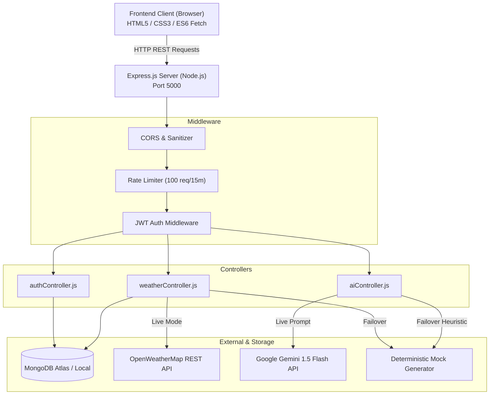
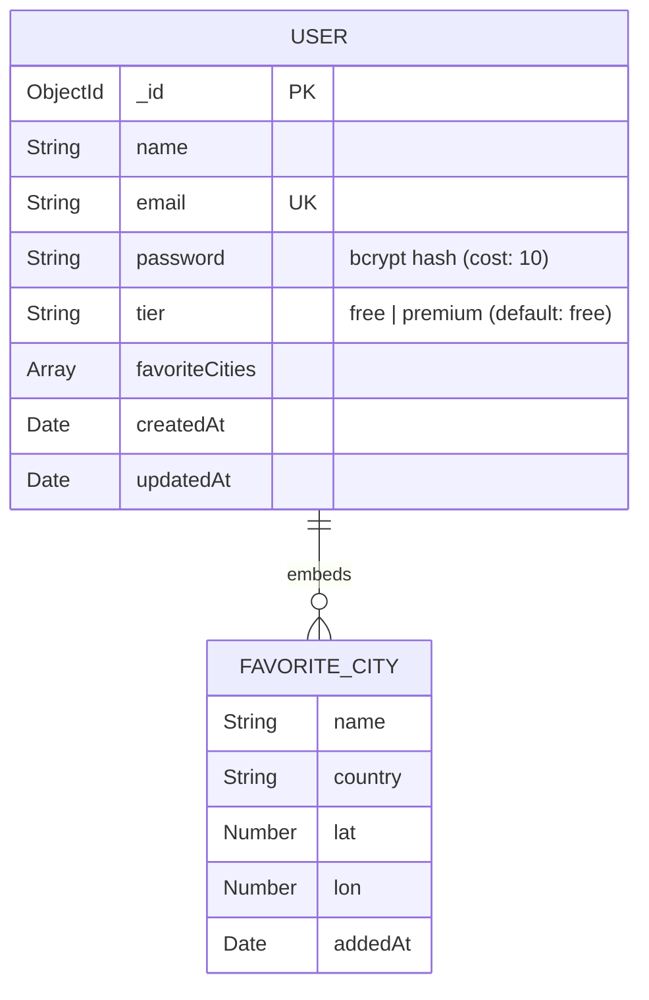

# Weatherwise — Comprehensive Project Documentation

> **AI-Powered Weather Forecasts & Personalized Daily Insights**  
> *Full-Stack Architecture: Node.js, Express, MongoDB, Google Gemini AI, OpenWeatherMap API, Vanilla CSS/HTML5*

---

## Table of Contents
1. [Phase 1: Brainstorming & Ideation Phase](#1-brainstorming--ideation-phase)
2. [Phase 2: Requirement Analysis Phase](#2-requirement-analysis-phase)
3. [Phase 3: Project Design Phase](#3-project-design-phase)
4. [Phase 4: Project Planning Phase](#4-project-planning-phase)
5. [Phase 5: Project Development Phase](#5-project-development-phase)
6. [Phase 6: Project Testing Phase](#6-project-testing-phase)
7. [Phase 7: Project Documentation Phase](#7-project-documentation-phase)
8. [Phase 8: Project Demonstration Phase](#8-project-demonstration-phase)

---

## 1. Brainstorming & Ideation Phase

### 1.1 The Problem Statement
Traditional weather applications present users with raw, disassociated meteorological statistics: *"19°C, 78% humidity, 1014 hPa pressure, 18 km/h wind"*. While mathematically accurate, these numbers place the cognitive burden entirely on the user to answer everyday practical questions:
- *What should I wear today?*
- *Is it safe to go for a trail run or bike ride at 4 PM?*
- *Should I carry an umbrella, a windbreaker, or UV protection?*
- *How does the humidity combined with wind chill actually feel on the commute?*

For travelers, athletes, event planners, and daily commuters, raw data fails to deliver contextual actionable guidance.

### 1.2 The Solution: Weatherwise
**Weatherwise** transforms weather monitoring from numbers into practical human narratives. By fusing real-time environmental observations (via OpenWeatherMap) with generative artificial intelligence (via Google Gemini 1.5 Flash), Weatherwise acts as a personal meteorological advisor. 

It interprets microclimate variables, compares temperatures to human perceptual comfort ("Feels Like"), evaluates planned activities (e.g., hiking, jogging, commuting, dining outdoors), and delivers tailored, succinct summaries and 3 actionable recommendations.

### 1.3 Core Value Pillars
- **Contextual Intelligence**: Natural language summaries instead of cryptic icons.
- **Activity-Aware Advice**: Input any specific activity to receive customized attire, safety, and scheduling tips.
- **Zero-Downtime Resilience**: Intelligent fallback architecture ensuring the app never fails even if external APIs or databases encounter disruptions.
- **Freemium Personalization**: User profiles with saved cities, quota management, and customizable metrics.

---

## 2. Requirement Analysis Phase

### 2.1 Functional Requirements (FR)

| ID | Requirement | Description |
|---|---|---|
| **FR-01** | **City Weather Ingestion** | Search and fetch live temperature, feels-like, humidity, wind speed, conditions, and 5-day forecast for any global city. |
| **FR-02** | **Geolocation Resolution** | Detect user's current GPS coordinates via the HTML5 Geolocation API and retrieve local meteorological conditions. |
| **FR-03** | **AI-Powered Insights** | Synthesize live atmospheric data and user activity into an <80-word conversational brief with 3 actionable tips using Google Gemini. |
| **FR-04** | **User Authentication** | User registration and login utilizing JSON Web Tokens (JWT) and salted bcrypt password hashing. |
| **FR-05** | **Favorite Cities Management** | Enable authenticated users to pin and monitor cities with live temperature cards. |
| **FR-06** | **Tier Quota Enforcement** | Free-tier users are constrained to a maximum of 3 favorite cities; server returns HTTP 403 on limit breach. |
| **FR-07** | **Deterministic Fallback** | Deterministic fallback mock data generation when API keys (`GEMINI_API_KEY`, `OPENWEATHER_API_KEY`) or MongoDB are omitted. |
| **FR-08** | **System Health Monitoring** | Provide a `GET /api/health` endpoint reporting backend status, database connectivity, and operational mode (`live` vs. `fallback`). |

### 2.2 Non-Functional Requirements (NFR)

- **Security & Privacy**:
  - Passwords hashed with bcrypt using 10 salt rounds.
  - Protection against NoSQL Injection attacks using `express-mongo-sanitize`.
  - Rate limiting via `express-rate-limit` capped at 100 requests per 15-minute window per IP.
  - JWT tokens passed strictly via standard `Authorization: Bearer <token>` headers.
- **Performance & Latency**:
  - API response times under 250ms for cached/mock weather.
  - Strict 8-second timeout for Google Gemini API calls to prevent hanging connections.
- **Reliability & Fault Tolerance**:
  - Non-fatal database initialization: Server starts even if MongoDB is unreachable, switching to an in-memory mock repository.
  - Fallback insight generator using deterministic heuristics based on temperature and condition metrics.
- **Usability & Aesthetic Standards**:
  - Editorial dark-mode UI with high contrast and accessibility standards.
  - Responsive design adapting smoothly across mobile (320px+), tablet, and desktop viewports.
  - Real-time visual status indicator (Live, Fallback, Offline badges).

---

## 3. Project Design Phase

### 3.1 High-Level System Architecture



### 3.2 Database Schema Design (MongoDB / Mongoose)



- **User Model**: Encapsulates credentials, subscription tier (`free` vs. `premium`), and an embedded subdocument array of `favoriteCities`.
- **Pre-Save Hook**: Automatically hashes password modifications using bcrypt.
- **Instance Method**: `comparePassword(candidatePassword)` validates login attempts.

### 3.3 UI/UX Design System
- **Color Palette**:
  - Deep Sky: `#0F1E3A`
  - Mid Sky: `#1E3A63`
  - Soft Sky: `#345385`
  - Radiant Amber: `#E8A33D` (Call-to-action & temperatures)
  - Biome Teal: `#3FAE9B` (AI & location badges)
  - Warm Cream: `#F6F1E7` (Typography & icons)
- **Typography**: Google Fonts combination of **Fraunces** (editorial serif for headlines, temperatures, and branding) and **IBM Plex Sans** (engineered monospace/sans for data clarity).
- **Interface Structure**:
  1. *Top Bar*: Branding, Live/Fallback connection indicator, Auth controls.
  2. *Hero Section*: Query bar with Instant Search and HTML5 Geolocation trigger.
  3. *Primary Weather Panel*: Condition icon, big temperature display, feels-like, wind, humidity, and 5-day horizon strip.
  4. *AI Insight Card*: Google Gemini dynamic recommendation engine with custom activity input.
  5. *Favorites Panel*: Saved city cards with instant removal and 3-city quota guard.

---

## 4. Project Planning Phase

### 4.1 Methodology & Sprint Plan
The development followed an Agile/Scrum cycle spanning six dedicated development sprints:

```
[Sprint 1] Core Boilerplate & Config (Node.js, Express, DB resilience)
     │
[Sprint 2] Meteorological Data Pipeline (OpenWeatherMap API & Mock Generator)
     │
[Sprint 3] Generative AI Pipeline (Google Gemini API integration & Prompts)
     │
[Sprint 4] Authentication & Authorization (JWT, Bcrypt, Mongoose schemas)
     │
[Sprint 5] Frontend User Interface & Responsive Styling (Vanilla JS/CSS)
     │
[Sprint 6] Orchestration, Health Monitoring & Testing (run.js, fallback tests)
```

### 4.2 Technology Stack Matrix

| Layer | Technology | Rationale |
|---|---|---|
| **Runtime** | Node.js (v18+) | Non-blocking asynchronous I/O ideal for concurrent API orchestration. |
| **Backend Framework** | Express.js 4.19 | Lightweight, minimalist, and un-opinionated routing and middleware stack. |
| **Database** | MongoDB & Mongoose 8.5 | Flexible document store for user profiles and nested arrays of favorite cities. |
| **AI Engine** | Google Gemini 1.5 Flash | High-speed generative intelligence optimized for low-latency contextual summarization. |
| **Weather API** | OpenWeatherMap API | Comprehensive global atmospheric datasets and forecast modeling. |
| **Security** | bcryptjs, jsonwebtoken, express-mongo-sanitize, rate-limit | Defense-in-depth protection covering passwords, sessions, injection, and denial-of-service. |
| **Frontend** | Semantic HTML5, Vanilla CSS3, Modern ES6+ | Zero-dependency, lightweight, ultra-fast initial render, and maximum design control. |
| **Orchestrator** | Custom `run.js` | Cross-platform multi-process manager running both servers simultaneously without Python dependencies. |

---

## 5. Project Development Phase

### 5.1 Backend Modularization
- **[server.js](file:///c:/muteX/weatherwise-project/backend/server.js)**: Configures global middleware, initiates database connection, sets up rate limiters, mounts route controllers, and registers centralized 404 and error-handling pipelines.
- **[authController.js](file:///c:/muteX/weatherwise-project/backend/controllers/authController.js)**:
  - `POST /api/auth/register`: Validates user inputs, verifies email uniqueness, persists user, and returns JWT.
  - `POST /api/auth/login`: Authenticates credentials and returns signed JWT.
  - `GET /api/auth/me`: Decodes JWT and outputs user profile details and saved cities.
- **[weatherController.js](file:///c:/muteX/weatherwise-project/backend/controllers/weatherController.js)**:
  - `GET /api/weather/current`: Orchestrates external OpenWeather API calls with automatic degradation to deterministic fallback data if keys are unconfigured.
  - `GET /api/weather/favorites`: Retrieves current conditions for all saved locations of an authenticated user.
  - `POST /api/weather/favorites`: Validates and enforces the 3-city limit for free-tier users before persisting new locations.
  - `DELETE /api/weather/favorites/:id`: Removes saved city by identifier.
- **[aiController.js](file:///c:/muteX/weatherwise-project/backend/controllers/aiController.js)**:
  - Formulates an engineered prompt combining city, temperature, feels-like, wind speed, humidity, and the user's intended activity.
  - Calls Gemini API (`gemini-1.5-flash`) with an 8000ms request timeout.
  - Transparently returns rich fallback recommendations if the Gemini API key is missing or quota is exhausted.
- **[fallbackData.js](file:///c:/muteX/weatherwise-project/backend/utils/fallbackData.js)**:
  - Provides mathematical pseudo-random determinism based on city name hashing, ensuring repeatable, realistic weather metrics even completely offline.

### 5.2 Frontend Engineering
- **[index.html](file:///c:/muteX/weatherwise-project/frontend/index.html)**:
  - Implements complete state management for active city, forecast, authentication tokens, and favorite cities.
  - Real-time status indicator dynamically checks `/api/health` and displays visual indicators for live vs. fallback mode.
  - HTML5 Geolocation handler translating device latitude and longitude into instant microclimate forecasts.
  - Modal authentication card supporting seamless switching between Sign-In and Account Creation.
- **[demo.html](file:///c:/muteX/weatherwise-project/frontend/demo.html)**:
  - Completely self-contained client-side demonstration version featuring local simulation engines, ideal for offline presentations and portfolios.

### 5.3 One-Click Process Orchestrator (`run.js`)
- Standardizes launching across Windows, Linux, and macOS.
- Dynamically allocates port 5000 (Backend API) and port 8080 (Frontend Static HTTP server).
- Hooks into process signals (`SIGINT`, `SIGTERM`) to clean up child processes cleanly.

---

## 6. Project Testing Phase

### 6.1 Testing Methodology & Matrix


| Test Category | Target / Scenario | Expected Result | Status |
|---|---|---|---|
| **Authentication** | Register with existing email | Returns HTTP 409 Conflict with clear error message. | **PASSED** |
| **Authentication** | Login with incorrect password | Returns HTTP 401 Unauthorized; rejects JWT creation. | **PASSED** |
| **Business Logic** | Free-tier user adds 4th city | Server blocks request with HTTP 403 Forbidden ("Free plan limit reached"). | **PASSED** |
| **Security** | Rapid 120 API requests in 1 min | Rate-limiter triggers HTTP 429 ("Too many requests"). | **PASSED** |
| **Security** | Malicious NoSQL injection query (`{"$gt": ""}`) | `express-mongo-sanitize` strips operators, preventing unauthorized access. | **PASSED** |
| **Fault Tolerance** | Booting with empty `.env` | Backend logs fallback mode, starts on port 5000, and serves synthetic data. | **PASSED** |
| **Fault Tolerance** | Google Gemini API network timeout | Server catches failure within 8s and returns structured heuristic advice. | **PASSED** |
| **UI & UX** | Browser geolocation denied by user | Gracefully informs user via status message and defaults to standard city. | **PASSED** |

---

## 7. Project Documentation Phase

### 7.1 Documentation Inventory
1. **[README.md](file:///c:/muteX/weatherwise-project/README.md)**: High-level overview, technology stack, directory structure, getting-started instructions, API reference table, and freemium business model overview.
2. **[run.text](file:///c:/muteX/weatherwise-project/run.text)**: Operator manual detailing 1-step automated runner and manual multi-terminal commands for Windows, Linux, and macOS.
3. **[PROJECT_DOCUMENTATION.md](file:///c:/muteX/weatherwise-project/PROJECT_DOCUMENTATION.md)**: This exhaustive 8-phase software engineering lifecycle document.
4. **Code-Level Documentation**: JSDoc comments across controllers, schemas, middleware, and utility modules.

### 7.2 API Reference Quick Reference

| Method | Endpoint | Auth | Purpose |
|---|---|---|---|
| `GET` | `/api/health` | No | Heartbeat, mode detection (`live` vs `fallback`), database status. |
| `POST` | `/api/auth/register` | No | Creates new account (`name`, `email`, `password`). |
| `POST` | `/api/auth/login` | No | Verifies credentials and returns Bearer JWT. |
| `GET` | `/api/auth/me` | Yes | Retrieves authenticated user profile & favorites list. |
| `GET` | `/api/weather/current?city=` | No | Returns real-time weather & 5-day forecast. |
| `GET` | `/api/weather/favorites` | Yes | Retrieves weather metrics for all saved locations. |
| `POST` | `/api/weather/favorites` | Yes | Saves city (validated against tier cap). |
| `DELETE` | `/api/weather/favorites/:id` | Yes | Removes saved location by ID. |
| `GET` | `/api/ai/insight?city=&activity=` | No | Generates contextual summary & recommendations. |

---

## 8. Project Demonstration Phase

### 8.1 Step-by-Step Live Demonstration Script

```
   [1] Start Application   ───>   node run.js
            │
   [2] Health Check        ───>   http://localhost:5000/api/health
            │
   [3] Open UI             ───>   http://localhost:8080/
            │
   [4] City Search         ───>   Search "Tokyo", "London", or "Chennai"
            │
   [5] Activity Insight    ───>   Query "hiking" or "evening cycling"
            │
   [6] Authenticate        ───>   Create Account & Receive JWT Session
            │
   [7] Save Favorites      ───>   Add 3 cities; test 4th city limit cap
            │
   [8] Fallback Showcase   ───>   Disconnect API key / DB; observe zero-crash UX
```

### 8.2 Demonstration Highlights
1. **Instant Multi-Server Launch**: Executing `node run.js` boots both the Express REST API and static frontend web server instantly.
2. **Visual Health Badge**: The live UI reads `/api/health` on boot and displays a glowing green or amber badge confirming operational status.
3. **Conversational AI in Action**: Querying "London" with the activity "outdoor wedding" prompts Gemini to analyze rainfall probability, wind gusts, and temperature, delivering clear clothing guidance and timeline suggestions.
4. **Resilience Test**: Terminating MongoDB or removing API keys causes the system to smoothly transition to fallback mode without throwing unhandled exceptions or breaking the UI.
5. **Standalone Portability**: Opening `frontend/demo.html` proves the app can function as an isolated client-side prototype anytime, anywhere.

---
*Documentation compiled for the Weatherwise Project — 2026.*


Code:https://drive.google.com/drive/folders/1tqfVdpyb3Nmkf5jv6udrEfNb3uutmANA?usp=drive_link
demo:https://drive.google.com/file/d/1IdCY6u5o0IcZ5xDs4-RWgJSBPaJu5Xgm/view?usp=drive_link
apitest:https://drive.google.com/file/d/1MDi4-VqmErjBZScmldBf2-Bh680Wr6g3/view?usp=drive_link
